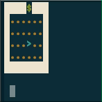
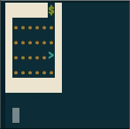
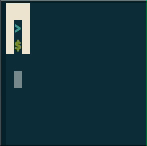
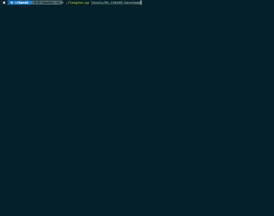

# Karel (now in Python)

> Karel is a pretty snazzy environment for learning to program.
> You can [read about it here](https://en.wikipedia.org/wiki/Karel_(programming_language)).\
> I decided to write a Karel environment for Python, after seeing that all of the others
> had too many dependencies for beginners.
>
> *Stephen Altamirano (`alts/karel`)*



## Write simple Karel programs

Writing in Python is **super fast and easy**!
Save a text file `YOUR_PROGRAM.py` in this folder, use import and start coding!

```python
from karel_run import *
# Simple program
move()
turn_left()
move()
```

> For a true unix executable, add the [shebang](https://stackoverflow.com/a/19305076/11105559),
> then the right to execute with `chmod +x YOUR_PROGRAM.py` and run it as `./YOUR_PROGRAM.py`.


## Karel functions

These are the functions you can use to command Karel after importing from `karel_run`:

```python
from karel_run import *
# Movement
move()       # Karel moves in the direction he is facing
turn_left()  # Karel turns left
turn_right() # Karel turns right
# Beepers
pick_beeper() # Karel tries to pick up a beeper
put_beeper()  # Karel puts down a beeper (if he has any)
beeper_is_present() # True if Karel stands on a beeper
# Walls
front_is_blocked()  # True if Karel can't move forward
front_is_treasure() # True if Karel is standing in front of a Treasure
# Direction
facing_north()  # True if Karel is facing north (^)
facing_south()  #                         south (v)
facing_east()   #                          east (>)
facing_west()   #                          west (<)
# Settings and execution
set_speed(100)   # How fast Karel moves, 0 to 100
set_karel_beepers(None)  # Set Karel's beepers, with None working as inf.
pause()      # Pause execution, press any key to continue
exit()       # End execution
```

Note that the map is loaded and screen started in the moment of `from karel_run import *`.
If you only need raw objects and methods see `karel.py`.


## Karel world

Karel maps are also simple text files and look like this one:

    1..#...
    #....^.

Karel is represented by the arrow (`^`) looking up.
There are two walls (`#`) and one beeper in the upper left corner (`1`).
There is no treasure (`$`).

> Planing to write maps? Check out the vim highlighting! :)


## Run your program

Open the terminal and write this command:

```bash
python3 YOUR_PROGRAM.py YOUR_MAP.karelmap
```

Press `Q` to quit or `P` to pause program.
Program pauses when Karel tries to make an illegal move.


## Try out your map with *interactive*

Use the command:
```bash
python3 karel_run.py YOUR_MAP.karelmap
```

You can now use your keyboard to control Karel.

    ⬆ ... move()
    ⬅ ... turn_left()
    ⮕ ... turn_right()
    I  ... pick_beeper()
    U  ... put_beeper()
    Q  ... stop()


## Examples

You can try these examples or study them for great knowledge. You can always quit their execution with `Q`.

### Example treasure

Run the program `example.py` (also below) with worlds `00` - `03_window`.
Karel will walk to the wall and then search for a treasure in the walls.

&emsp;&emsp;

The idea comes from a [paper on cooperative learning in CS1](https://dl.acm.org/doi/abs/10.1145/2492686).

<details>
  <summary>Karel searching for treasure Python code</summary>

  ```python
  from karel_run import *
  
  while not front_is_blocked():
      move()
  
  while not front_is_treasure():
      turn_left()
      if front_is_blocked():
          turn_left()
      # FIX: add else
      move()
      turn_right()
  ```
</details>


### Langton's ant

The program `langton.py` (also below) makes Karel a [Langton's ant](https://en.wikipedia.org/wiki/Langton%27s_ant),
using a single beeper to mark a tile as "Black" and Karel can pick it up to make it "White".



The ant moves seemingly randomly, but makes a nice picture in about 11000 steps. Try with the world `04_140x50`.

<details>
  <summary>Langton's ant Python code</summary>

  ```python
  from karel_run import *
  set_speed(100)
  
  while True:
      if not beeper_is_present():  # At a white square
          put_beeper()  # flip the color of the square
          turn_right()  # turn 90° right
          move()        # move forward one unit
      else:  # At a black square
          pick_beeper() # flip the color of the square
          turn_left()   # turn 90° left
          move()        # move forward one unit
  ```
</details>
