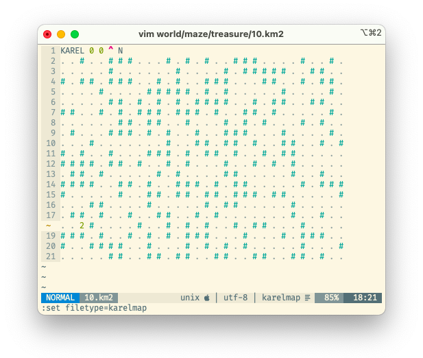

<p align="center">
   
</p>


# Karel the Robot (now in Python)

<p>
<a href="https://www.python.org/downloads/release/python-360/">
  
</a>
<a href="https://pypi.org/project/karel-robot/">
  
</a>
<a href="https://github.com/psf/black">
  
</a>
</p>


> Karel is a pretty snazzy environment for learning to program.
> You can [read about it here](https://en.wikipedia.org/wiki/Karel_(programming_language)).\
> I decided to write a Karel environment for Python, after seeing that all of the others
> had too many dependencies for beginners.
>
> *Stephen Altamirano (`alts/karel`)*


## Installation

Installing should be as simple as opening your terminal and writing:
```bash
pip3 install karel_robot
```

## Write simple Karel programs

Coding in Python is **super fast and easy**!
Save a text file `example.py` in this folder, use import and start coding!

```python
from karel_robot.run import *
# you can call imported functions
turn_left()

# or use Python, like loops ('while') or logical 'not'
while not front_is_blocked():
    move()
```

> For a true unix executable, add the [shebang](https://stackoverflow.com/a/19305076/11105559),
> then the right to execute with `chmod +x example.py` and run it as `./example.py`.


If you break a Karel program, it should not leave your terminal screen broken in retaliation, otherwise please
file an [Issue](https://github.com/xsebek/karel/issues/new/choose).
More advanced or courageous programmers are welcome to look into the `karel_robot` folder and read about the details.


## Karel functions

These are the functions you can use to command Karel after importing from `karel_robot.run`:

| Function              | Result                                            |
|-----------------------|---------------------------------------------------|
| **Movement**          |                                                   |
| `move()`              | Karel moves in the direction he is facing         |
| `turn_left()`         | Karel turns left                                  |
| `turn_right()`        | Karel turns right                                 |
| **Beepers**           |                                                   |
| `pick_beeper()`       | Karel tries to pick up a beeper                   |
| `put_beeper()`        | Karel puts down a beeper (if he has any)          |
| `beeper_is_present()` | True iff Karel stands on a beeper                 |
| **Walls**             |                                                   |
| `front_is_blocked()`  | True iff Karel can't move forward                 |
| `front_is_treasure()` | True iff Karel is standing in front of a Treasure |
| **Direction**         |                                                   |
| `facing_north()`      | True iff Karel is facing north (`^`)              |
| `facing_south()`      | True iff Karel is facing south (`v`)              |
| `facing_east()`       | True iff Karel is facing east (`>`)               |
| `facing_west()`       | True iff Karel is facing west (`<`)               |
| **Execution**         |                                                   |
| `set_karel_beepers(None)`| Set Karel's beepers, with `None` as inf.       |
| `set_speed(100)`      | How fast Karel moves, 0 to 100                    |
| `pause()`             | Pause execution, press any key to continue        |
| `message(text, pause)`    | Show a text message to user.                      |
| `save()` | Save the map in file specified by `--output`. |
| `exit()` | End execution |


Note that the map is loaded and screen started in the moment of import:
```python
from karel_robot.run import *
```
If you only need raw objects and methods see the directory [karel_robot](./karel_robot).


## Karel world

There are many maps in [`world`](.world) directory. Karel maps are simple text files and look like this one:

    1..#...
    #....^.

Karel is represented by the arrow (`^`) looking up on the empty tile (`.`).\
There are two walls (`#`) and one beeper in the upper right corner (`1`).
There is no treasure (`$`).

This does not allow us to use more then 9 beepers and place Karel on beeper or other non-empty tile.

#### New Karel map format

A new map format has file extension `.km2` but it is still plain text file − you can change it to `.txt`:

```
KAREL 2 1 > N
#  1  .  #  #  .  . 21
#  #  9  .  #  .  #  #
6  .  .  .  .  .  .  #
```

The above map places Karel right on the 9 beepers.
Note that there are 21 beepers in the upper right corner in one tile, which the original format does not support.
The mysterious `N` in Karel's header sets the number of beepers he starts with to unlimited, which is the most fun.

#### Editor support

Do you want to write or edit maps? Check out the vim highlighting!

<p align="center">
   
</p>


## Run your program

Open the terminal and write this command:

```bash
python3 YOUR_PROGRAM.py  # -m YOUR_MAP.km or other options
```

Press <kbd>Q</kbd> to quit or <kbd>P</kbd> to pause program.
Program pauses when Karel tries to make an illegal move.

### Example treasure
<details>
  <summary>Click to expand!</summary>
Run the program `treasure.py` (also below) with worlds `00` - `03_window`.
Karel will walk to the wall and then search for a treasure in the walls.


&emsp;&emsp;&emsp;

The idea comes from a [paper on cooperative learning in CS1](https://dl.acm.org/doi/abs/10.1145/2492686).

<details>
  <summary>Karel searching for treasure Python code</summary>

  ```python
  from karel_robot.run import *
  
  while not front_is_blocked():
      move()
  
  while not front_is_treasure():
      turn_left()
      if front_is_blocked():
          turn_left()
      # FIX: add else
      move()
      turn_right()
  ```

</details>

</details>


### Langton's ant
<details>
  <summary>Click to expand!</summary>
Here is a short animation of Karel playing
Langton's ant.<sup>[[wiki]](https://en.wikipedia.org/wiki/Langton%27s_ant)</sup>

<p>
  
</p>

The program `ant.py` (also below)  uses a single beeper to mark a tile as "Black"
and Karel can pick it up to make it "White".
The ant moves seemingly randomly, but makes a nice picture in about 11000 steps.
The command to recreate the recording is:

```bash
programs/ant.py -x 70 -y 50 --karelpos 35 25 --kareldir ^ --output langton.km2
```

<details>
  <summary>Langton's ant Python code</summary>

  ```python
  from karel_robot.run import *
  set_speed(100)

  while True:  # repeat
      if beeper_is_present(): # At a black square
          pick_beeper()           # flip the color of the square
          turn_left()             # turn 90° left
          move()                  # move forward one unit
      else:                   # At a white square
          put_beeper()            # flip the color of the square
          turn_right()            # turn 90° right
          move()                  # move forward one unit
  ```

</details>

</details>


## Try out your map with *interactive*

Run the `karel` script with any of the options:
```bash
karel --help                       # 0. prints the actual usage
karel                              # 1. opens in infinite map, fills the whole screen
karel -m "world/1_window.km"      # 2. opens the simple text file map in world directory
karel --ix -m "world/easy/tiny.km2"  # 3. simillar to 2., but forces the
```

You can now use your keyboard to control Karel.

|     Key    |  Function       |
|------------|-----------------|
|<kbd>↑</kbd>| `move()`        |
|<kbd>←</kbd>| `turn_left()`   |
|<kbd>→</kbd>| `turn_right()`  |
|<kbd>I</kbd>| `pick_beeper()` |
|<kbd>U</kbd>| `put_beeper()`  |
|<kbd>Q</kbd>| `stop()`        |

> There is also <kbd>W</kbd> for saving to file (specified by `--output`) and couple of keys for ~~cheating~~ testing!


## Recursive Karel

You can try your wits in creating iterative programs with only **if** statements, procedure definition and recursion!
It is pretty mind bending so lets look at an example:

```markdown
DEFINE MAIN
    IFWALL PUT MOVE
    IFWALL SKIP MAIN
END
RUN MAIN
```

After the program is parsed and run, the `MAIN` function will call itself again until it reaches a wall.
When that happens, Karel will put down a beeper and the execution stops.

Here is a more complex recursive program searching through a maze for a tile with two beepers:

<p>
  
</p>
You can define new procedures by writing <kbd>DEFINE <i>new_name</i></kbd>
and then writing names of procedures and statements into its body,
which you then <kbd>END</kbd>.

These statements are the simple building blocks you can use
and combine with your new procedures:

|                  Statement                  | Note                                                         |
| :-----------------------------------------: | ------------------------------------------------------------ |
|               <kbd>MOVE</kbd>               | Karel steps forward.                                         |
|               <kbd>LEFT</kbd>               | Karel turns 90° left - note that there is no `RIGHT` :)      |
|               <kbd>PUT</kbd>                | Karel puts down one beeper.                                  |
|               <kbd>PICK</kbd>               | Karel picks up one beeper.                                   |
|               <kbd>SKIP</kbd>               | Does nothing - like `pass` in Python.                        |
| <kbd>IFWALL</kbd> <kbd>✓</kbd> <kbd>𐄂</kbd> | If `front_is_blocked()` then `pass` else `move()`            |
| <kbd>IFMARK</kbd> <kbd>✓</kbd> <kbd>𐄂</kbd> | If `beeper_is_present()` then `pick_beeper()` else `put_beeper()` |

The interpret in `karel_robot.parsers.interpret` is used by the `karel` executable:

```sh
karel --program programs/graph/3_treasure.ks --map world/maze/treasure/07.km2 --speed 20
```


## Credits 🤖

The original author is Stephen Altamirano (@alts).
Recently this has been updated by @Tetragramm and @xsebek.

The package on PyPI is maintained by @xsebek.

If you want to contribute, check out the `karel_robot` folder [README](karel_robot/README.md).


## LICENSE

This project is released under GNU GPLv3 (or later) license in hopes that
it will be useful. You are encouraged to share this *freely* and can
even sell it provided everyone will still be able to read and modify
the source code, just like you are and keeps the license. :wink:
